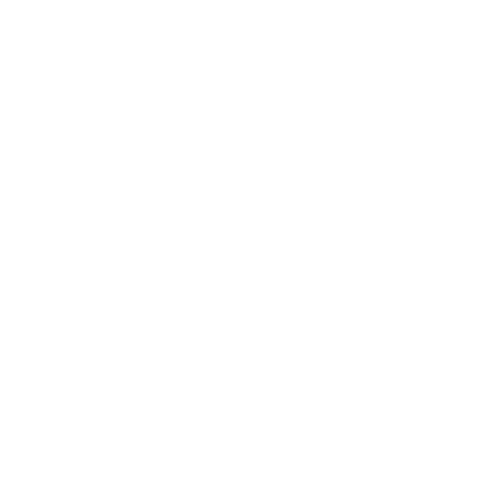

<h1 align="center">
  <picture>
    <source media="(prefers-color-scheme: dark)" srcset="logo-dark.svg">
    
  </picture>
  <br>
  SAVR - Semantic Automated Version Release
</h1>

> Automate semantic releases seamlessly with conventional commits.

SAVR automatically generates and updates semantic version releases and drafts based on your commit messages, streamlining your GitHub release workflow.

## Features

- 🔄 Automatically detects version bumps based on commit messages
- 📝 Generates detailed release notes from commit history
- 🏷️ Creates and updates draft releases
- 🔧 Configurable version tag prefix and commit message patterns
- 🧪 Dry-run mode for testing

## Usage

```yaml
name: Release Draft
on:
  push:
    branches:
      - main

jobs:
  release:
    runs-on: ubuntu-latest
    steps:
      - uses: actions/checkout@v4
        with:
          fetch-depth: 0

      - name: Create Release Draft
        uses: 21stdigital/savr-action@v1
        with:
          github-token: ${{ secrets.GITHUB_TOKEN }}
          # Optional configuration:
          # tag-prefix: 'v'
          # dry-run: false
          # release-notes-template: |
          #   ## Release {{version}}
          #   {{#each commits}}
          #   - {{this.message}} ({{this.type}})
          #   {{/each}}
```

## Inputs

| Input                    | Description                                    | Required | Default                       |
| ------------------------ | ---------------------------------------------- | -------- | ----------------------------- |
| `github-token`           | Token used for GitHub API authentication       | Yes      | -                             |
| `tag-prefix`             | The prefix for version tags                    | No       | `v`                           |
| `release-branch`         | The branch to use for the release              | No       | `main`                        |
| `commit-regex`           | Custom regex pattern for commit messages       | No       | Conventional Commits standard |
| `dry-run`                | Simulate the process without creating releases | No       | `false`                       |
| `release-notes-template` | Template for release notes formatting          | No       | Default template              |
| `bump-rules`             | Custom commit type to version bump mapping     | No       | Default rules                 |
| `initial-version`        | The initial version to start from              | No       | `1.0.0`                       |

## Outputs

| Output        | Description                                  |
| ------------- | -------------------------------------------- |
| `version`     | The calculated version for the release       |
| `release-url` | The URL of the created/updated draft release |
| `release-id`  | The ID of the created/updated draft release  |

## Version Bump Rules

The action follows these rules to determine version bumps:

- **Major** (`1.0.0`): Breaking changes (`feat!` or `BREAKING CHANGE` in footer)
- **Minor** (`0.1.0`): New features (`feat`)
- **Patch** (`0.0.1`): Bug fixes (`fix`)
- **None**: Other changes (no version bump)

## Release Notes

Release notes are automatically generated and include:

- ✨ Features
- 🐛 Bug fixes
- 💥 Breaking changes
- Contributors list

The default template format is:

```handlebars
{{#if features}}
  ### ✨ Features
  {{#each features}}
    -
    {{this.message}}
  {{/each}}
{{/if}}

{{#if fixes}}
  ### 🐛 Fixes
  {{#each fixes}}
    -
    {{this.message}}
  {{/each}}
{{/if}}

{{#if breaking}}
  ### 💥 Breaking Changes
  {{#each breaking}}
    -
    {{this.message}}
  {{/each}}
{{/if}}
```

## Contributing

Contributions are welcome! Please feel free to submit a Pull Request.

## License

MIT
